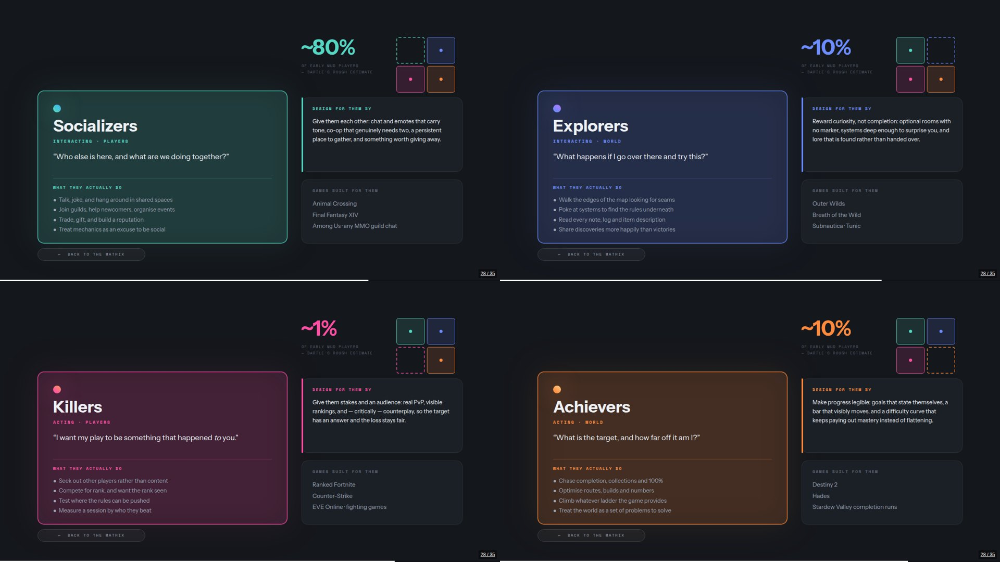
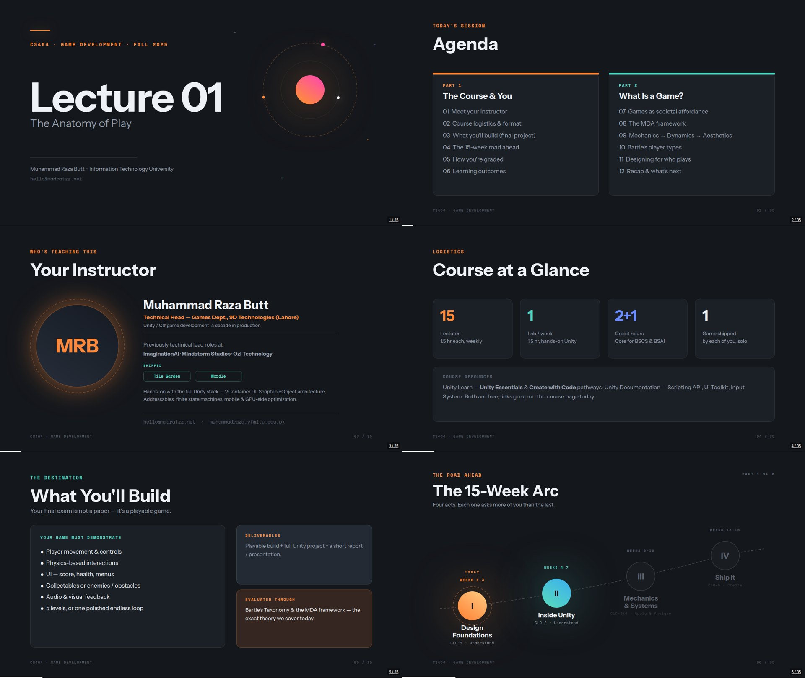

# Lecture 01 — The Anatomy of Play

35 slides. Deliberately theory-first: the course opens Unity in week four, and this
lecture exists so the room shares a vocabulary before anyone writes a line of C#.

**Deck:** [`CS464-Lecture-01-Anatomy-of-Play.bento.html`](CS464-Lecture-01-Anatomy-of-Play.bento.html)
— double-click to open. Every slide has speaker notes (`S` in present mode).

## What it covers

| Slides | Section |
|--------|---------|
| 1–5 | Cover, agenda, instructor, course at a glance, what you'll build |
| 6–7 | The 15-week arc — four acts on a rising trajectory, revealed across two pages |
| 8–9 | How you're graded — donut plus components, revealed three at a time |
| 10 | Learning outcomes, mapped to CLOs and Bloom levels |
| 11–17 | What is a game? Parts of a game, the magic circle, designing it, rules of play, finite vs infinite games, what games give us |
| 18–25 | The MDA framework — mechanics, dynamics, aesthetics, the 8 kinds of fun, a worked example |
| 26–32 | Who plays? Richard Bartle, the taxonomy, player types in the wild, the action matrix, designing for who plays |
| 33–35 | Key takeaways, next up, questions |

## Slides worth knowing about before you present

**The 15-week arc (6–7)** is a two-page reveal. Page one lights only acts I and II;
advance once and acts III and IV bloom from dark husks into glowing discs while the
midterm marker lands between them. Don't skip past page one — the reveal is the point.

**Grading (8–9)** works the same way: three components, then the other three.

**The MDA trio (19–21)** shares one content box that changes colour, and a chain on
the right whose highlight walks down as you advance. Three slides, one idea in three
positions.

**Bartle's taxonomy (28)** is interactive. The matrix draws its axes, then the four
quadrants land one at a time. Clicking any quadrant expands it into a full brief —
motivation, what that type actually does, the share of players, how to design for
them, and games built around them — while the other three shrink into a locator in
the corner. Arrow keys skip all four expansions, so the linear lecture is unaffected
and you can open whichever ones the room asks about. A back button returns you.



## Previews

Contact sheets of all 35 slides: [`preview/`](preview/).



## Rebuilding the deck

The deck is generated. `src/build_doc.py` writes the document JSON into the
`#bento-doc` block of the HTML file in place:

```bash
cd src && python3 build_doc.py
```

It needs `src/fonts/fonts.json` (Instrument Sans and Space Mono as woff2 data URIs;
the deck embeds them so the typefaces are not left to whatever the presenting
machine happens to have installed). Paths at the bottom of the script point at the
deck; adjust them if you move things.

After any change, open the deck and run `window.bento.validate()` in the browser
console. It should report 0 errors and 0 warnings. It will not catch overlapping
elements or a panel that looks empty, so look at the slides too.
